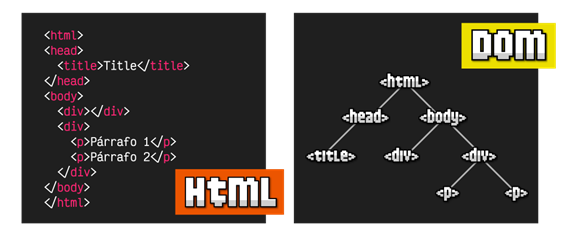
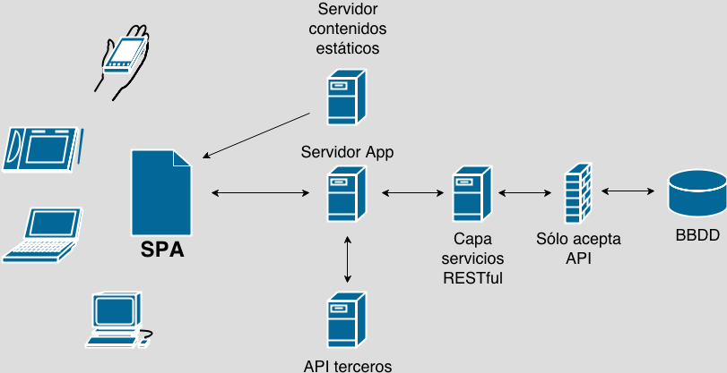

# Apunte 08 - Javascritpt y HTML - SPA

## ¿Qué es el DOM? (*)

Cuando se comienza en el mundo del desarrollo web, normalmente se comienza por aprender a escribir etiquetado o marcado HTML y además, añadir estilos CSS para darle color, forma y algo de interacción. Sin embargo, a medida que avanzamos, nos damos cuenta que en cierta forma podemos estar bastante limitados.
Si únicamente utilizamos HTML/CSS, sólo podremos crear páginas estáticas, es decir, páginas que no pueden mostrarse de una forma diferente dependiendo de acciones del usuario. Si añadimos Javascript, podremos crear páginas **dinámicas**, es decir, aprovechar la potencia y flexibilidad que nos da un lenguaje de programación para crear documentos y páginas mucho más ricas, con una experiencia más completa y con las que se pueden automatizar un gran abanico de tareas y acciones.
Las siglas DOM significan Document Object Model, o lo que es lo mismo, la estructura del documento HTML. Una página HTML está formada por múltiples etiquetas HTML, anidadas una dentro de otra, formando un árbol de etiquetas relacionadas entre sí, que se denomina **árbol DOM** (o simplemente **DOM**).



Es esencialmente una interfaz de plataforma, o API de programación para documentos HTML, que proporciona un conjunto estándar de objetos para representar documentos HTML y otros similares, un modelo estándar sobre cómo pueden combinarse dichos objetos, y una interfaz estándar para acceder a ellos y manipularlos. A través del DOM, los programas pueden acceder dinámicamente y modificar el contenido, estructura y estilo de los documentos.
En Javascript, cuando nos referimos al DOM nos referimos a esa estructura de árbol, mediante la cuál podemos acceder a ella y modificar los elementos del HTML desde Javascript, añadiendo nuevas etiquetas, modificando o eliminando otras, cambiando sus atributos HTML, añadiendo clases, cambiando el contenido de texto, etc...
Al estar controlado por un lenguaje de programación, todas estas tareas se pueden automatizar, incluso indicando que se realicen cuando el usuario haga acciones determinadas, como por ejemplo: pulsar un botón, mover el ratón, hacer click en una parte del documento, escribir un texto, etc...

### El objeto document

En Javascript, la forma de acceder al DOM es a través de un objeto llamado **document**, que representa el árbol DOM de la página o, más concretamente, la página de la pestaña del navegador donde nos encontramos. En su interior pueden existir varios tipos de elementos, pero principalmente serán **ELEMENT** o **NODE**:

* **ELEMENT**: no es más que la representación genérica de una etiqueta: **HTMLElement**.
* **NODE**: es una unidad más básica, la cuál puede ser **ELEMENT** o un nodo de texto.

Todos los elementos HTML, dependiendo del elemento que sean, tendrán un tipo de dato específico.

Algunos ejemplos:

| Tipo de dato genérico | Tipo específico    | Etiqueta         | Descripción                                          |
|-----------------------|--------------------|------------------|------------------------------------------------------|
| `HTMLElement`             | `HTMLDivElement`      | `<div>` | Etiqueta divisoria (en bloque).    |
| `HTMLElement`             | `HTMLElement`      | `<span>`| Etiqueta divisoria (en línea).    |
| `HTMLElement`             | `HTMLImageElement`      | ``| Imagen.                            |
| `HTMLElement`             | `HTMLAudioElement`      | `<audio>`| Contenedor de audio.              |

### Establecer referencias a objetos

El DOM define la manera en que objetos y elementos se relacionan entre sí en el navegador y en el documento.
En JavaScript, cada objeto tiene un nombre, el cual es exclusivo y único. Cuando existe más de un objeto del mismo tipo en un documento web, estos se organizan en un vector.
Es posible asignarle una identificación a un objeto, y luego usarlo para hacer referencia a este, por ejemplo:

En documento html:

``` HTML  
<div id="Idiomas">
  <li>Español</li>
  <li>Ingles</li>
  <li>Frances</li>
</div>
```

Para hacer referencia a este elemento se puede usar la función `getElementById`

En Javascript

```js
document.getElementById("Idiomas")
```

Y realizar alguna operación sobre el mismo, en este caso agregamos un nuevo elemento:

```js
document.getElementById("Idiomas").innerHTML += "<li>Portugues</li>"
```

### Manipular las propiedades y funciones de objetos

En la mayoría de los objetos computacionales algunas propiedades se pueden determinar de la siguiente manera:

```js
Objeto.propiedad = valor;
```

La manipulación de objetos sigue los mismos principios que en el lenguaje de programación que se esté utilizando. Una de las características de estos objetos es la función para la cual están diseñados, de hecho en la mayoría de ocasiones tienen más de una función. En JavaScript, muchas funciones para cada uno de los objetos, incluyendo el navegador y la ventana que lo contiene, han sido definidas previamente; adicionalmente, el usuario puede definir funciones de acuerdo a sus necesidades.

```js
Objeto.funcion(parametro);
```

### Eventos

En la creación de páginas web los eventos representan la interacción del usuario con la computadora.
Cuando alguno de estos eventos ocurre, como por ejemplo la presión de algún botón del ratón, es deseable que la computadora responda de alguna manera. Esta es la razón por la que existen event handlers ('encargados de manejar eventos') los cuales son objetos que responden a eventos. Una manera de añadir eventos en el DOM utilizando JavaScript es:

```js
<element onevent="script">....</element>
```

Por ejemplo:

```js
<div id="midivision" onClick="javascript:miFuncion('bar');">
Aquí va otro texto
</div>
```

Otra forma de manipular eventos en JavaScript, al crear páginas web, es tratándolos como propiedades de los elementos que forman la página, por ejemplo:

```js
objeto.evento = funcion;

document.getElementById("midivision").onclick = hazAlgo;
```

En DOM se considera que un evento se origina en el exterior de la página web y se propaga de alguna manera hasta los elementos internos de la página. Un posible ejemplo de esta propagación es:

* EVENTO → Ventana → Document → HTML → BODY → DIV → DESTINO
* RESPUESTA → DIV → BODY → HTML → Document → Ventana → EVENTO

Siguiendo esta idea, se establecen tres etapas: **captura**, la cual se da cuando el evento se está trasladando a su destino. **Blanco**, que ocurre cuando llega al blanco, o sea que llega a su destino. Este destino es el objeto en el cual se va a crear una reacción a este evento. Finalmente la etapa de **burbujeo** que ocurre cuando el evento "regresa" a su posición original.

Ciertos objetos pueden estar pendientes de ciertos eventos. Para hacer esto el objeto añade un **oyente de eventos** con la función `addEventListener`. Cuando el evento ocurra, alguna función determinada se lleva a cabo. En este proceso se indica en qué momento la función se lleva a cabo, ya sea en la etapa de captura o en la etapa de burbujeo. Este momento se indica con la palabra **true** si debe ocurrir en la etapa de captura o **false** si debe ocurrir en la etapa de burbujeo. En JavaScript se escribe de la siguiente manera:

```js
objeto.addEventListener(evento, funcion, momento);

document.getElementById("mydivision").addEventListener("click", hazAlgo, false);
```

### Librerías de terceros

Javascript nos proporciona un conjunto de herramientas para trabajar de forma nativa con el DOM de la página, pero en muchos casos, el rendimiento no es lo suficientemente importante como para justificar trabajar a bajo nivel, por lo que se prefiere utilizar algunas librerías de terceros que nos facilitan el trabajo a costa de reducir minimamente el rendimiento, pero permitiéndonos programar más rápidamente.

En ese caso, lo normal suele ser elegir un framework Javascript. La mayoría de los frameworks de JS utilizan un **Virtual DOM**, es decir, una abstracción para automatizarlo sin que el programador tenga que manipularlo a bajo nivel, sino mediante otras estrategias. Librerías o frameworks como **React**, Vue o Angular, son bastante populares por esto.

>Aunque los frameworks Javascript no trabajen directamente con el DOM, esto no significa que sea una mala práctica acceder al DOM. Cada >framework tiene sus propias normas, consejos y formas de hacer las cosas. Se aconseja que el programador sepa trabajar con el DOM porque >muchas veces tener esa visión hace que sea mucho más fácil a la hora de pensar para resolver problemas.

### Ejercitación: Lista de tareas

Se pide crear una página HTML para administrar una lista de tareas pendientes. Debe haber un formulario con un campo de entrada de texto para agregar nuevas tareas y un botón para añadirlas a la lista. Además, cada tarea en la lista debe tener un botón para eliminarla. La página debe mostrar inicialmente una lista vacía y permitir al usuario agregar y eliminar tareas según sea necesario.

Ver código del ejercicio [aquí](./js/lista_tareas/)

## ¿Qué es una SPA? (*)

Una **SPA** o **Aplicación de una Sola Página** es una web que todo su contenido carga una sola vez, es decir, el navegador descarga un sólo archivo html con todos los recursos y dependencias que necesite para funcionar: estilos, scripts, imágenes, fuentes, etc.

Una vez que carga todo el contenido de la aplicación la navegación de esta suele ser muy rápida y fluida, pues el contenido ya ha sido previamente cargado y sólo se necesita intercambiar contenido a través de las interacciones del usuario.

Dependiendo de la complejidad y robustez de la aplicación también podría cargarse contenido de forma dinámica sin la necesidad de recargar la página mediante peticiones asíncronas con **AJAX** de tal manera que sólo se tiene que cargar el nuevo contenido.

## Varias vistas, no varias páginas (*)

El hecho de tener una sola página, no implica no tener tener varias vistas, es decir los diferentes apartados que podría tener el sitio Web. A ojos del usuario es como si tuviese varias páginas que cargan muy rápido, pero en realidad son vistas en la misma página.


Entonces, si todo está en la misma página, *¿quiere decir esto que no cambia la URL del navegador?*

No, no quiere decir eso, es más, lo más normal es que vaya cambiando según nos movemos entre vistas. Pero la clave aquí, es que en realidad no estás cargando una página, tan solo sustituyendo el contenido de la misma.

Entonces, ¿para qué cambiar la URL?

## Rutas en las SPA (*)

Por funcionalidad quizas NO sería necesario que cambiáse la url, pero por usabilidad es una muy buena opción que **si** cambie, ya que el navegador va guardando en su **historial** todas las páginas (en este caso todas las vistas) que el usuario va visitando, lo que podría permitir al usuario regresar o adelantar vistas a través de los botones de atrás y adelante de su navegador web.

También en necesario pensar en la posibilidad de que el usuario en vez de navegar por la aplicación para llegar a un contenido en particular, decida acceder a este a través de una url que decida escribir manualmente en la barra de dirección de su navegador web, si no se implementa un sistema de rutas esto podría ser un gran problema de accesibilidad en el contenido de la SPA.

Pero si el contenido se carga en una sóla página, **¿cómo cambiamos la url?**

Gracias al uso del hash de la url y el paso de parámetros en la misma.

## Hash URL (*)

El final de una URL puede contener una palabra separada por un símbolo de almohadilla **(#)**. Esto es lo que se conoce como **elemento hash de la URL** y permite posicionarse dentro de una parte determinada de la página. Esto lo conseguimos de forma sencilla mediante HTML.

La URL **miweb.html#elementoA** se va a posicionar en la página en el elemento HTML que contenga el identificador **elementoA**.

Pero, **¿cómo podemos acceder al hash de la URL con Javascript?** Es decir, qué hacer si queremos controlar cuando el usuario llegue con una URL que contenga una etiqueta o elemento de hash.

La solución es bastante sencilla y es que en **JS** existe el objeto **location**, el cual hace referencia a la URL que maneja el navegador, este objeto facilita acceder al hash de la URL con Javascript.

En concreto la propiedad del objeto location llamada **.hash**  devuelve el hash de la URL.

> console.log(location.hash)

Para poder controlar los cambios del elemento hash de la URL, Javascript ofrece la posibilidad de manejar un evento de ventana llamado **hashchange**. Para registrar este evento se utiliza:

> window.addEventListener("hashchange", funcion_manejador)

Combinando el elemento **hash** de la URL (más el paso de parámetros) con el evento **hashchange** del objeto window es posible definir una política de rutas (o de ruteo) de las SPAs.

## ¿En que lenguaje de programación se hacen las SPA?

Esto es fácil, las SPA siempre están hechas con **JavaScript**. No hay otro lenguaje, ya que este tipo de webs se ejecutan en el lado del cliente, es decir, en el navegador, y ahí solo se ejecuta JavaScript.

**Pero si el código de una SPA es 100% frontend ¿qué pasa con el código backend que proporciona los datos?**

El código backend que provee los datos a una SPA, es 100% independiente de esta. De hecho a la SPA le importa poco en qué lenguaje este programado su backend o que reglas, patrones, estructuras o técnicas use internamente, mientras este le proporcione los datos en una API expuesta generalmente en formato JSON es todo lo que la SPA necesita de un backend.

Con lo anterior expuesto, significa que desarrollar un proyecto bajo el paradigma de las SPAs puedes programar de **forma independiente** el **frontend** del **backend** y sólo conectarlo a través de la API que los comuniqué entre sí.

De esta forma es posible mantener mayor control e independencia de desarrollo entre cada una de las partes de código (frontend y backend) de todo tu proyecto.

De hecho en los últimos años el paradigma de desarrollo de las SPAs le ha ido ganando terreno al patrón de desarrollo MVC (Modelo - Vista - Controlador) que fue muy popular en los inicios de la web, en este paradigma el frontend y backend estan mezclados y con mucha dependencia entre sí, además quien llevaba la mayor responsabilidad era el backend y generalmente con cada nueva acción en la aplicación implicaba volver a solicitar los datos al servidor lo que implicaba una recarga al navegador, y por ende una nueva petición por cada acción ejecutada.

Con la llegada de AJAX el tema de las recargas al servidor se solucionó, sin embargo la codependencia y mezcla entre código frontend y backend sigue ocurriendo en el paradigma MVC.



Actualmente con el avance que ha tenido JavaScript como lenguaje y la proliferación de librerías y frameworks que se basan en él, sumado a las nuevas formas de almacenar y consumir información en la web como el cómputo en la nube y el desarrollo de microservicios en la misma; el paradigma de las SPAs cada vez gana mayor aceptación frente al MVC, gracias a que permite desarrollar de forma autónoma e independiente cada parte de código de nuestra aplicación: frontend, backend y persistencia de datos desacoplados y descentralizados de sí mismos.

Angular, **React**, Ember.js, Polymer, etc, son ejemplos de frameworks y librerías que nos permiten construir SPAs de manera eficiente. En las semanas siguientes puntualmente abordaremos el uso de **React** para construir los prácticos de la asignatura.

## ¿Y el SEO en una SPA?

Algo importante a considerar es que la mayoría del contenido de una SPA se carga de forma dinámica, por lo que los mecanismos que tienen los buscadores para analizar el código HTML de las urls prácticamente son inservibles, pues en su mayoría, las SPAs tienen un sólo tag HTML vacío con un nombre de identificador y mediante JavaScript, el contenido es cargado de forma asincrónica a dicho tag.

Por lo anterior el código HTML de nuestra SPA estaría vacío ante los rastreadores de los buscadores, encargados de posicionar el contenido en la web. Esto último es lo que se conoce como SEO (Search Engine Optimization); se trata del conjunto de estrategias y técnicas de optimización que se hacen en una página web para que aparezca orgánicamente en buscadores de Internet como Google, Yahoo o Youtube. La correcta aplicación del SEO puede causar incrementos expresivos en el tráfico y la visibilidad de las marcas en Internet.

Si bien las SPAs no son tan amigables con el SEO, lo cierto es que en los últimos años los mismos buscadores han implementado mecanismos en sus rastreadores para detectar el código HTML generado por una SPA.

Adicionalmente existen 2 técnicas para volver más **SEO friendly** las SPAs:

* Los Generadores de Sitios Estáticos (SSG - Static Site Generators) y
* El Renderizado del Lado del Servidor (SSR - Server Side Rendering).

Dependerá del uso de la SPA para priorizar estas técnicas de renderizado.

## Bibliografía o Referencia

* [Aprende Javascript](https://aprendejavascript.org/)

> ---------------------------------------------------------------------
